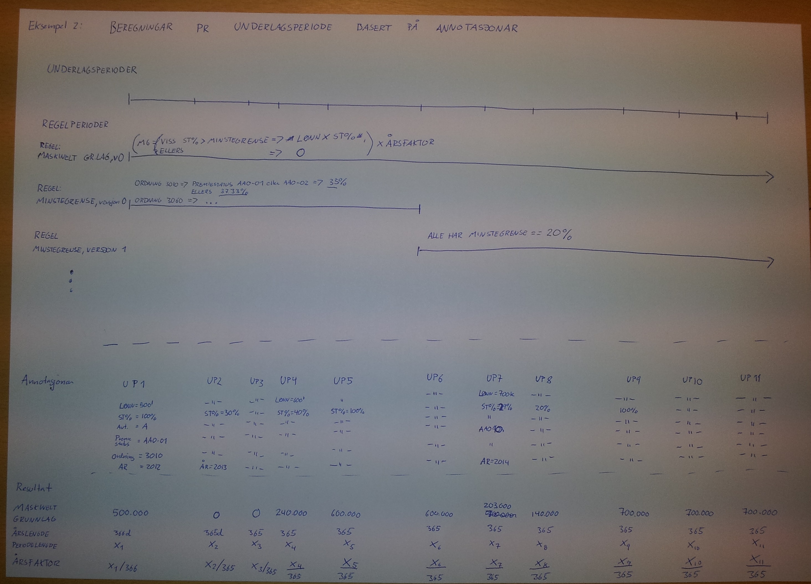

# Tidsperiode-underlag-lib

## 1. Moduldokumentasjon

|                  |                                                                                                                                                                                                                                                                                                                                                                                         |
|:-----------------|:----------------------------------------------------------------------------------------------------------------------------------------------------------------------------------------------------------------------------------------------------------------------------------------------------------------------------------------------------------------------------------------|
| Oppgave          | Generering av underlag og underlagsperioder for å understøtte:<ul><li>Fastsats</li><li>Prognosefakturering av fastsatspremie</li><li>Beregning av riktig årspremie ved avregning av tidligare innbetalt fastsatspremie</li><li>Periodisere gjeldande avtale- og arbeidsgiverinformasjon for å forenkle datakvalitets- og rapporteringsoppgåver</li><li>Panda Reserveberegning</li></ul> |
| Modulnavn        | felles-tidsperiode-underlag-lib                                                                                                                                                                                                                                                                                                                                                         |
| Versjonskontroll | felles-tidsperiode-underlag-lib (GIT)                                                                                                                                                                                                                                                                                                                                                   |
| Pakke            | <ul><li>no.spk.pensjon.felles.tidsperiode</li><li>no.spk.pensjon.felles.tidsperiode.underlag</li></ul>                                                                                                                                                                                                                                                                                  |
| Hovedklasser     | <ul><li>no.spk.pensjon.felles.tidsperiode.Tidsperiode</li><li>no.spk.pensjon.felles.tidsperiode.underlag.Underlag</li><li>no.spk.pensjon.felles.tidsperiode.underlag.UnderlagFactory</li></ul>                                                                                                                                                                                          |
| Versjonering     | Sjå [Fellesmodul - felles-tidsperiode-underlag-lib - Endringshandtering](dokumentasjon/Endringshandtering.md)                                                                                                                                                                                                                                                                           |
| Branchingmodel   | JPL fra Master (feature == større feature, master == nåtilstand, tag fra master == release)                                                                                                                                                                                                                                                                                             |

## 2. Bakgrunn

SPK har gjennom 1900- og 2000-tallet mottatt og tatt vare på det som etterkvart har blitt eit mellomstort datasett med 
informasjon om alle medlemmars lønn og pensjon, i tillegg til alle arbeidsgivarars relevante arbeidsgivar-, avtale- og 
premieinformasjon. Gjennom dei siste snart 100 åra har vi og lært ein viktig regel, stort sett alle typer grunnlagsdata 
kan når som helst endre seg, både i notid, framtid og fortid. Tilbakevirkande endringar utgjer ein betraktelig andel av 
SPKs årlige sett med endringar på grunnlagsdatane. SPK må blant anna kunne handtere endringar av typen 
"å nei du, det som vi i går sa hadde skjedd har aldri skjedd/har ikkje skjedd enda". Ein må kunne svare på spørsmål som 
"Kva trudde SPK den 5. desember om korleis verda såg ut 7. januar forrige år?", "Korleis antar SPK at verda vil sjå ut 
1 år fram i tid, gitt dei grunnlagsdatane som var gjeldande for 4 månader sidan". I ein kvardag der ein aldri kan anta 
noko som helst om at denne regelen eller denne verdien er alltid gyldig, må ein derfor ha eit veldig bevist forhold til 
korleis ein skal bearbeide og utlede ny informasjon basert på tidsperiodiserte grunnlagsdata.

Desse utfordringane har leda SPK til å anvende ein to-dimensjonal representasjon av tid for dei aller fleste av sine 
grunnlagsdatatyper nettopp for å kunne spore og bearbeide informasjon om kva verdiar som er, var eller vil bli gjeldande 
på eit gitt tidspunkt i tid. Ein opererer i denne modellen med to tidsaksar, heretter kalla registreringsdato-tidsaksen 
og aksjonsdato-tidsaksen.

Registreringsdato-tidsaksen indikerer på kva dato/tidspunkt SPK mottok informasjon frå omverda og lagra det i sine 
datasystem. Aksjonsdato-tidsaksen indikerer kva dato den mottatte informasjonen blir gyldig/trer i kraft.

Formålet med felles-tidsperiode-underlag-lib er å tilby ein grunnmur for handtering av tidsperiodiserte grunnlagsdata 
med fokus på aksjonsdato-tidsaksen:

«Gitt grunnlagsdata henta ut på eit gitt punkt på registreringsdato-tidsaksen, korleis ser grunnlagsdatane ein vil 
behandle ut langs aksjonsdato-tidsaksen på denne datoen?»

## 2.1 Opprinnelig rasjonale for modulen

Denne modulen vart opprinnelig utforma og implementert som ein ikkje-generell modul spissa inn mot fakturering og 
premieberegning. Ein del av tankesettet og prinsippa som ligg til grunn er derfor opprinnelig henta frå dette domenet. 
Beskrivelsen nedanfor er derfor bevart for å gi litt kontekst som kan hjelpe ein å forstå litt meir konkret kva behov 
modulen starta ut med å skulle dekke (då under navnet faktura-prognose-tidsserie):

Årlig fakturerer SPK rundt 15-16 milliardar i fastsats-premie, fordelt på rundt 2300 avtalar og 1600+ kundar. Den årlige 
premien blir beregna basert på den pensjonsgivande årslønna til kvar avtale. Det einaste vi veit om den pensjonsgivande 
årslønna til arbeidsgivarane er at den over tid er i kontinuerlig endring. Frå månad til månad skjer det store og små 
endringar i antall ansatte, antall årsverk og lønnsnivå. Med systemløysinga for fastsats fakturering som var i bruk i 
perioda 2011-2014 har konsekvensen av dette blitt at premiane endrar seg kontinuerlig gjennom heile året.

Frå og med 2015 har ein endra metodikk for fastsats faktureringa. Ein lagar 1-2 prognoser der ein gjer ei kvalifisert 
gjetning på kva maskinelt grunnlag pr avtale kjem til bli ved utgangen av premieåret ein skal fakturere for. Ut frå 
dette blir det rekna ut ein prognosepremie som ein gjennom premieåret sender ut faktura av. Mot slutten av året eller 
seinare i andre premieår reknar ein ut den pensjonsgivande årslønna på nytt for å sjekke om den innbetalte premien 
framleis er lik det som skulle blitt innbetalt. Ved avvik avregnar ein seg fram til ein sum som avtalane skal betale 
inn eller få attende.

For generering av prognosepremie har analyseavdelinga i FPO utvikla ein statistisk modell som dei køyrer for å lage 
prognoser på kva beregna pensjonsgivande årslønn vil bli ut frå tidsseriar generert ved hjelp av domenemodellen som vi 
her forsøker å dokumentere. For at prognosegenereringa skal fungere, treng den eit datasett som inneheld månedlige 
målingar av pensjonsgivande årslønn for dei siste 10 åra (ca).

Modulen faktura-prognose-tidsserie inneheld domenemodellen som lar ein bygge opp slike datasett i form av 
underlagsperiodar som ein kan utlede tidsseriar frå. Tidseriane vil typisk inneholde målingar av blant anna 
pensjonsgivande årslønn pr dags dato på månedsbasis for dei siste 8-10 åra.

## 3. Beskrivelse

For å betre kunne forstå korleis modulens formål og oppbygging, må eit par sentrale begrep definerast først:

| Begrep          | Definisjon |
| :---            | :---       |
|Tidsperiode      |Ei tidsperiode representerer eit tidsintervall som strekker seg mellom to datoar. Tidsperioder inneheld alltid ein frå og med-dato og kan inneholde ein til og med-dato. Dersom tidsperioda ikkje har ein til og med-dato er den ei løpande tidsperiode, dersom den har ein til og med-dato er den ei lukka tidsperiode.|
|Underlagsperiode |Ei lukka tidsperiode som garanterer at ingen andre tidsperioder har ein frå og med- eller til og med-dato som ligg mellom underlagsperiodas frå og med- og til og med-dato. Underlagsperiodas hovedformål er derfor å garantere at ingen data som er er ute etter å gjere observasjonar av eller utrekningar basert på, endrar seg i løpet av underlagsperioda.|
|Underlag         |Ei samling ikkje-overlappande, kronologisk sorterte underlagsperioder utan tidsgap mellom kvar underlagsperiode. Underlaget har som hovedformål å sikre at ein basert på ei samling med tidsperiodiserte grunnlagsdata skal kunne utlede eit sett med underlagsperioder som garanterer at ingen grunnlagsdata endrar verdi innanfor kvar underlagsperiode, at endringar kun skjer på underlagsperiodenes frå og med-dato.|

## 4. Overordna designprinsipp

Basert på erfaringa SPK har gjort seg ved vedlikehald og vidareutvikling av forrige systemløysing for fakturering av 
fastsatspremie (sjå faktura-tjeneste / PU_FAK_BA_01), har denne modulen blitt designa basert på følgjande prinsipp:

* Sporbarheit
    * Alle grunnlagsverdiar og reglar for generering av målingar, skal periodiserast for å ta hensyn til at alle desse 
    over tid kan endre seg
    * Alle verdiar og utrekningar må relativt enkelt kunne sporast tilbake til underlagsperiodenes annotasjonar og reglar
* Heller CPU og RAM som den store flaskehalsen, enn I/O
    * Vi lastar heller inn alle grunnlagsdata i minne enn å be om litt og litt om gangen frå datakilder utanfor prosessar
    som skal gjere utrekningar
    * Vi forventar å kunne drive massiv parallellprosessering ved å skalere ut, framfor å måtte skalere opp
    * Vi forventar å ikkje bli påtvungne flaskehalsar grunna krav til synkronisering innanfor proessar som skal gjere 
  utrekningar
* «Null er tull»
    * Verdiar som er null er ein bug, valgfrie verdiar skal vere deklarert som eksplisitt valgfrie

### 4.1. Sporbarheit

Bakgrunnen for at sporbarheit er eit viktig prinsipp for designet er todelt.

I åra der faktureringsløysinga var ustabil og det var mange problem med premiefaktureringa, har spesielt feilsøking av 
typen "kvifor vart premien lik kr X?", "kvifor er grunnlaget sånn som det der?" og "korleis ville grunnlaget ha sett ut 
på dato Y?" vist seg å vere ekstremt tidkrevande.

Ein har og erfart at det ofte viser seg at utrekningane som er utført er 100% korrekte, gitt grunnlagsdatane som var 
registrert/synlige på utrekningstidspunktet. Det er derimot endringar som er registrert i etterkant som gjer at 
beregningane ser ut til å vere feil.

Tilsvarande, ettersom mellomtilstandane som vart danna ved utrekning av blant anna pensjonsgivande årslønn og årspremie, 
kun eksisterte internt i løysinga når den vart køyrt, har det i praksis vore umulig for ein tredjepart utan 
systemutviklingsmessig kompetanse, å ettergå resultatet av utrekningane. Forsøk på å trekke ut og gjere tilgjengelig 
slik interntilstand har også stranda. Ein drivande faktor for dette har vore at designet på den gamle løysinga ikkje 
var tilrettelagt for å eksponere verdiar som blir brukt eller generert internt.

Til slutt, ved å spesialbehandle alle tidsvarierande datatyper litt forskjellig for kvar slik datatype eller gjennom å 
anta at visse verdiar er "spesielle" og ikkje treng periodisering, har den resulterande løysinga enda opp med å bli 
krevande å forstå. Det har ført til at det var risikabelt og tidkrevande både å feilrette og vidareutvikle løysinga.

Oppsummert: Alle utleda verdiar frå eit underlag bør kunne forklarast eller utledast kun ut frå annotasjonane og 
overordna kunnskap om reglane i underlaget.

### 4.2. Heller CPU og RAM som den store flaskehalsen, enn I/O

Det neste prinsippet har sin bakgrunn i erfaringane ein har gjort seg i forhold til ytelse generelt for SPKs 
utrekningsmodular og -applikasjonar.

Den første prototypen for prognosetidsserie i fastsatsfakturering vart i likheit med det store fleirtal av 
tidligare løysingar i SPK, implementert som ei I/O-intensiv, databasefokusert løysing. Og den forrige systemløysinga
for fastsatsfakturering var implementert etter liknande metodikk. Felles for begge variantane var at antall 
stillingar ein var i stand til å gjere utrekningar på var i størrelsesorden eit par tusen pr minutt. Konsekvensen var
køyretider som kunne målast i timar og dagar (!).

Eksempel: Ein 10-årig tidsserie for prognoser på pensjonsgivande årslønn krever i snitt rundt 50 utrekningar pr 
stilling. Med ein ytelse på 4000-5000 utrekningar pr minutt og litt over 1 million stillingar gir det ei forventa køyretid på drøyt ei 
veke.

Vi setter derfor behovet for å redusere I/O til eit absolutt minimum som eit av våre viktigast prinsipp. Ein av 
hovedintensjonane med eit Underlag er derfor å samle alle data som er påkrevd for alle utrekningar som skal 
gjennomførast slik at ingen oppslag av ekstra informasjon er påkrevd medan utrekningane køyrer.
 
Vi fokuserer på å understøtte prosessar som tar inn alle grunnlagsdata for eit medlem, ein avtale eller ei bestand, ved
oppstart, framfor gradvis å spørre om meir og meir ved behov.

Vi fokuserer på å kunne lineært skalere ut pr medlem, utan å kreve synkronisering mot delte datastrukturar som senkar 
skaleringsevna vår.
  
Oppsummert: CPU og RAM er relativt sett nær gratis ytelsesmessig, I/O er "the destroyer of worlds", den store dødaren.

### 4.3 «Null er tull»

Det eit grunnleggande prinsipp for designet er at valgfriheit skal vere eksplisitt, ingen verdiar skal 
nokonsinne kunne vere null. Det skal framgå eksplisitt alle stadar der ein har valgfrie verdiar, at dei er valgfrie.

Oppsummert: Valgfriheit blir kommunisert i form av datatypen 
[Optional](https://docs.oracle.com/javase/8/docs/api/java/util/Optional.html), ikkje som verdiar som kan ha null som verdi.

## 5. Overordna struktur

Tidsseriegenereringa er delt opp og organisert i 2 hovedområde:

| Navn	      | Beskrivelse |
| :--- | :--- |
| Tidsperiode  |Kjernekonseptet Tidsperiode med eit par SPK-uavhengige, periode eller dato-relaterte støttetyper (År, Årstall, Måned, Generell tidsperiode, Antall dagar)|
| Underlag     |Kjernekonsept for utrekning og behandling av tidsperiodiserte datasett. Periodiserer på tvers av alle tidsperiodenes endringsdatoar og bygger opp ei finkorna underlag beståande av underlagsperioder som aldri kan overlappe eller ha tidsgap mellom periodene. Sluttresultatet blir at ein kan eliminere eller sterkt redusere behovet for at seinare utrekningsreglar skal måtte forholde seg til tid og datoar ved utrekning av utleda verdiar.|

_Pakkediagram: felles-tidsperiode-underlag-lib_

### 5.1. Tidsperiode

_Pakkediagram: no.spk.felles.tidsperiode_

Det nederste nivået i designet inneheld dei sentrale abstraksjonane som heile periodiseringsdesignet baserer seg på.

Det er blant anna her ein finn sjølve grensesnittet Tidsperiode som alle tidsperioder i systemet må implementere. 

Ei tidsperiode er implementert basert på følgjande grunnreglar:
- Ei tidsperiode skal alltid ha ein frå og med-dato
- Ei tidsperiode kan ha ein til og med-dato, men viss den er løpande er til og med-dato valgfri
- Frå og med- og til og med-dato er inklusiv, det vil seie at perioda strekker seg over begge desse datoane og alle 
datoane i mellom dei to
- Frå og med-dato til ei tidsperiode kan vere lik periodas til og med-dato, det betyr då at perioda strekker seg over ein 
dag.
- Frå og med-dato til ei tidsperiode kan aldri vere etter periodas til og med-dato

Ettersom ein ved seinare oppbygging av underlag er avhengig av å kunne sjekke om to tidsperioder overlappar kvarandre, 
eller om ei periode overlappar ein bestemt dato, er denne logikken plassert direkte i Tidsperiode-grensesnittet.

Ver spesielt oppmerksom på at ein kan forvente i størrelsesorden 100-1000 millionar sjekkar på om to perioder 
overlappar, i løpet av oppbygginga av ein 10-årig tidsserie for heile medlemsbestanden til SPK (600k+ medlemmar, 
1+ million stillingsforhold).

I tillegg til sjølve Tidsperioda inneheld pakken og verdiobjekt for å representere identifiserande verdiar ala Årstall 
eller målingar av kor mange dagar ei tidsperiode inneheld.

Til slutt inneheld pakken også tre sentrale tidsperiodetyper:

- År
- Månad
- Generell tidsperiode

Dei to første er som navna indikerer, tidsperioder som strekker seg over henholdsvis eit heilt år og ein heil månad i 
eit bestemt år. Den siste periodetypen er ein støttetype for å representere ei generell tidsperiode som ikkje har nokon 
grunnlagsdata eller andre verdiar tilknytta seg sjølv.

### 5.2. Underlag

_Pakkediagram: no.spk.felles.tidsperiode.underlag_

På nivået over tidsperiode og grunnlagsdata, finn vi underlag.

Ettersom store delar av datagrunnlaget for SPK kan endre seg over tid, er det i heilt essensielt å vere 100% sikker på 
kva verdi som var gjeldande på kvar ein einaste dag gjennom alle årstalla ein skal gjere utrekningar for.

Pakken underlag inneheld algoritma som genererer ein representasjon av når det skjer endringar i det tidsperiodiserte 
datagrunnlaget som vil kunne påvirke utrekningar.

Denne representasjonen er  delt opp i to sentrale konsept, Underlag og Underlagsperiode.

#### 5.2.1. Underlag

Eit Underlag er ei kronologisk sortert samling med Underlagsperioder. Underlagsperiodenes frå og med- og til og 
med-datoar blir generert basert på følgjande enkle algoritme:

- Legg til alle input-perioders frå og med-dato i ei samling som inneheld unike datoar
- Legg til alle input-periodes til og med-dato + 1 dag i samlinga frå steg 1
- For perioder utan til og med-dato, løpande perioder, bruk observasjonsperiodas til og med-dato + 1 dag
- Sorter alle datoane i kronologisk rekkefølge, med eldste dato først og yngste dato sist
- Fjern alle datoar som ligg utanfor observasjonsperioda

Gå gjennom lista med datoar og opprett ei ny underlagsperiode der frå og med-dato er lik datoen frå lista, og til og 
med-dato er lik neste dato i lista, minus 1 dag.

Som ein følge av denne enkle algoritma, vil underlaget garantere at det ikkje eksisterer nokon tidsgap mellom 
underlagsperiodene. Kvar underlagsperiode (utanom den første) startar dagen etter forrige underlagsperiode sluttar. 
Algoritma garanterer og at ingen av underlagsperiodene overlappar andre underlagsperioder. Totalt sett garanterer 
dermed algoritma at i eit Underlag vil alle datoar mellom første underlagsperiode sin frå og med- og siste 
underlagsperiode sin til og med-dato, vere dekka av ei og berre ei underlagsperiode.

#### 5.2.2. Underlagsperiode

Ei underlagsperiode representerer ei tidsperiode der det ikkje skjer nokon endringar av grunnlagsdatane innanfor perioda.

Underlagsperiodene har tre primære funksjonar:

- Koble saman generelle og SPK-spesifikke tidsperiodetyper med underlagsperioda/-ene som dei overlappar, heretter kalla koblingar
- Tilby enkel tilgang til grunnlagsdatane som er gjeldande innanfor underlagsperioda, heretter kalla annotasjonar
- Tilby enkel tilgang til beregningsreglar for å kunne rekne ut premierelaterte verdiar basert på underlagsperiodas koblingar og annotasjonar

#### 5.2.3. Beregningsregel / Regelperiode

Ettersom også regelverk er noko ein ikkje kan anta er uendra over tid er konseptet BeregningsRegel og Regelperiode 
innlemma som ein naturlig del av underlagsperiodenes grensesnitt og koblingar.

For å vite kva reglar som er gjeldande på ein bestemt dato kan reglar leggast til ved oppbygging av underlaget via 
datatypen Regelperiode blitt oppretta.

Intensjonen her er at regelperioder blir lagt til som ei av dei mange forskjellige typene tidsperioder som blir brukt 
som input ved generering av underlag. På den måten vil alle regelperioder som er gjeldande i ei bestemt tidsperiode bli 
lagt til som koblingar på underlagsperiodene som overlappar denne perioda. Ein må deretter annotere underlagsperiodene 
med kvar regelperiodes tilhøyrande beregningsregel. På denne måten får vi eit klart og tydelig ansvarsskille mellom 
regelperiodene som styrer når reglane er gjeldande og reglane som kan implementerast som tidsuavhengig, enkel 
programlogikk.

Konsekvensen av dette designet blir at reglane blir forventa å vere enkle å teste, utvikle og feilsøke. Reglane blir og 
forventa å få eit veldig avgrensa ansvarsområde, ettersom dei via underlagsperioda kan samhandle og kalle andre 
beregingsreglar utan å måtte forholde seg til detaljane i korleis dei andre reglane er implementert og gjort 
tilgjengelig for bruk.

### 5.3. Eksempel

#### 5.3.1. Koblingar, annotasjonar og beregningsreglar

For å konkretisere korleis dei 3 primære funksjonane til Underlagsperiode fungerer, vil vi i avsnitta og illustrasjonen 
nedanfor, bruke eit konkret eksempel på korleis eit underlag blir sjåande ut. I dette eksempelet er det illustrert 
korleis underlaget for eit stillingsforhold som er aktivt i perioda 3. september 2012 til 30. juni 2015, vil sjå ut.

#### 5.3.2. Tidsperioder / grunnlagsdata

Stillinga startar i 100% stilling med opprykk frå lønnstrinn 50 via 60 til 70 i løpet av perioda det er aktivt. 
Stillingsprosenten går i siste periode ned frå 100% til 95%.

I løpet av perioda byttar også stillinga avtale, frå avtale A1 til avtale A2, frå og med 1. januar 2014.

Ettersom lønnstrinna endrar seg på årlig basis gjennom heile perioda, tar underlaget hensyn til at ein vil ha 3 (evt 5, 
litt avhengig av korleis ein ser på det) lønnstrinnperioder som overlappar den aktuelle tidsperioda. Det varierer frå 
år til år kor mange av desse ein må ta hensyn til, nettopp fordi stillinga hoppar mellom fleire lønnstrinn i løpet av 
perioda.

Til slutt ser vi og at vi har lagt inn 3 årsperioder. Ved hjelp av desse er vi dermed sikra at underlaget kjem til å 
inneholde underlagsperioder der ingen av dei strekker seg over meir enn 1 år om gangen og ingen underlagsperioder har 
ein frå og med- og til og med-dato i forskjellige år.

For eit meir realistisk eksempel ville ein og kunne legge inn månadsperioder og dermed få ein garanti for at ingen 
underlagsperioder strekker seg over meir enn ein månad.

#### 5.3.3. Koblingar

I illustrasjonen nedanfor har ein for kvar einaste underlagsperiode, tegna opp ei visuell oversikt over kva tidsperioder 
som den overlappar. Dette er først illustrert i form av pilene som peikar opp frå kvar underlagsperiode til kvar av 
tidsperiodene som den overlappar. I tillegg er det symbolisert i tabellen under Underlagsperiodene, markert som 
Koblingar i tegninga.

For den første underlagsperiode ser vi at det kun er årsperiode A1 (årstall 2012), som den overlappar. Dette fortel oss 
dermed at det ikkje eksisterer eit aktivt stillingsforhold i denne underlagsperioda.

For den andre underlagsperioda ser vi at den overlappar både årsperiode A1 og lønnstrinnperiode L1 (som inneheld 
grunnlagsdata som fortel oss at lønnstrinn 50 tilsvarar kr 500 000 i 100% stilling innanfor denne underlagsperioda).

Først i den tredje underlagsperioda eksisterer det ei stillingsforholdperiode som overlappar underlagsperioda. Vi ser at 
underlagsperioda overlappar årsperiode A1, lønnstrinnperiode L1, stillingsforholdperiode S1 og avtalekobling A1. Basert 
på denne perioda kan vi dermed utlede at vi har ei aktiv stilling, gjeldande stillingsprosent er 100%, gjeldande 
lønnstrinn er lønntrinn 50, gjeldande lønn for lønnstrinn 50 i 100% stilling er kr 500 000 og gjeldande avtale for 
stillinga er avtalen som A1 peikar til.

#### 5.3.4. Annotasjonar

I mangel på gode idear til eit meir beskrivande ord eller eksisterande uttrykk som vi kan erstatte det med, har vi valgt 
å kalle neste konsept for ein annotasjon.

Ein annotasjon er tenkt å skulle vere ein måte å kopiere frå, eller peike tilbake til, grunnlagsdata som er henta frå 
koblingane til ei underlagsperiode.

Det er illustrert i tegninga nedanfor under Annotasjonar-seksjonen, rett under Koblingar.

For kvar underlagsperiode har ein, ved hjelp av koblingane, navigert tilbake til alle tidsperiodene som overlappar 
underlagsperioda. Frå desse periodene har ein henta grunnlagsdatane som er gyldige og kopiert dei ned til 
underlagsperioda. Eller sagt på ein annan måte, ein har annotert  underlagsperioda med verdiar henta frå 
underlagsperioda sine koblingar.

For dei første to underlagsperiodene har ein i eksempelet valgt å ikkje annotere underlagsperiodene med noko som helst. 
Men merk at ein her kunne ha annotert første periode med annotasjonen Årstall lik 2012. Den andre perioda kunne ein ha 
annotert med Årstall lik 2012 og lønnstrinn = 50.

Men, i periode 3 har ein annotert underlagsperioda med følgjande verdiar:

|Annotasjonstype	|Verdi       |
| :---              | :---       |
|Lønnstrinn         | 50         |
|Lønnstrinn 50      | kr 500 000 |
|Stillingsprosent	| 100%       |
|Årstall            | 2012       |

Merk at her ville ein i eit meir realistisk eksempel og ha lagt til informasjon om stillingsforholdnummer, avtalenummer, 
lønnsnivå, nivå på faste- og variable lønnstillegg, funksjonstillegg med meir.

For dei resterande underlagsperiodene skjer det samme, legg merke til at kvar einaste gang grunnlagsdatane på 
underlagsperiodenes koblingar, endrar tilstand, så skjer det på ei ny underlagsperiode og den blir annotert med dei nye 
verdiane og dei andre, fortsatt gjeldande verdiane frå dei grunnlagsdatane som ikkje har endra tilstand.

_Eksempel: Underlag basert på informasjon om stillingsforhold,avtalekobling, lønnstrinn, år og månedar_

#### 5.3.5. Beregningsreglar

I etterkant av at underlaget er bygd opp, underlagsperiodene er danna, kvar underlagsperiode har blitt knytta til sine 
koblingar og kvar underlagsperiode har blitt annotert med verdiar henta frå koblingane sine grunnlagsdata, er alt klart 
for å utføre beregningar.

Ettersom beregningsreglane sin skal benytte, også er noko som kan endre seg over tid, blir også dei annotert på 
underlagsperiodene. Meir informasjon om korleis det skjer, finn du i avsnitt 5.2.

Når kvar underlagsperiode har blitt annotert med både grunnlagsdata og alle beregningsreglar som er gjeldande innanfor 
underlagsperioda, har ein tilgang til alt som er påkrevd for å faktisk utføre beregningar av premierelaterte verdiar for 
kvar einaste underlagsperiode.

Som ein følge av denne oppdelinga kan no dei aller fleste beregningsreglane sjå bort frå tid som konsept og kun utføre 
beregningar av nivå, klienten kan deretter konvertere nivået basert på kvar periodes årsfaktor for å komme fram til ein 
årsbasert verdi av typen maskinelt grunnlag for eit bestemt premieår.

I illustrasjonen nedanfor er det satt opp eit eksempel der regelen som utledar kva som er gjeldande minstegrense i kvar 
underlagsperiode, endrar seg midt i observasjonsperioda. Ein går der over frå dagens metodikk der minstegrensa varierer 
frå ordning til ordning, til ein forenkla variant der alle ordningar opererer med ei og samme minstegrense, frå og med 
ein bestemt dato.

Nederst i illustrasjonen kan ein sjå resultata som blir generert ved å kalle beregningsreglane som er henta frå 
underlagsperiodene sine regelperiode-koblingar. Ein ser her korleis nivået for maskinelt-grunnlag endrar seg frå periode 
til periode, og heil nederst korleis årsfaktor blir rekna ut basert på annotasjonen for årstall som igjen blir brukt for 
å rekne ut kor mange dagar det er i året.

_Eksempel: Beregningar for kvar underlagsperiode basert på annotasjonar og beregningsreglar_

## 6. Oppsett av utviklingsmiljø

- Verifiser at du har java 17 installert og satt opp som default java for shellet du brukar når du skal bygge modulen

    $ echo $JAVA_HOME
    C:\apps\jdk.1.17.0_XX
    $ java -version
    java version "1.17.0_XX"
- Sjekk ut modulen via GIT:

    git clone http://git.spk.no/scm/fellesjava/felles-tidsperiode-underlag-lib.git
- Bygg modulen via Maven:

    mvn clean verify
- Importer modulen inn i IntelliJ / Eclipse / <Insert your IDE of choice here> som eit Maven-prosjekt/-modul.

## 7. Test av modulen

### 7.1. Integrasjonstester

Modulen er satt opp til å køyre sine integrasjonstestar i Maven-fasa integration-tests ved hjelp av 
maven-failsafe-plugin. For å køyre integrasjonstestane (i tillegg til enheitstestane) bør derfor følgjande kommando 
benyttast:

    mvn verify

Integrasjonstestane blir ikkje køyrt som ein del av Maven-fasa test, ein kan dermed køyre enheitstestane utan å måtte 
køyre alle integrasjonstestane viss ein benyttar følgjande kommando:

    mvn test

På generell basis skal både enheits- og integrasjonstestane å bli køyrt på under 10 sekund, det eksisterer ikkje og skal 
heller ikkje bli lagt til, nokon avhengigheiter som medfører behov for I/O mot eksterne system/databasar og som dermed 
vil forringe køyretida til ei full gjennomkøyring av heile testsuita for modulen.

## 8. Ofte spurte spørsmål

### 8.1. Korleis fiksar eg byggefeil generert av japicmp-maven-plugin?

Viss ein har vore inne og gjort endringar bør ein i så stor grad som mulig, unngå å bryte bakoverkompatibilitet med 
tidligare versjonar. Dersom ein har vore inne og gjort endringar uten å tenke på dette kan ein derfor fort komme til 
å ha gjort ei endring som bryter bakoverkompatibiliteten fordi ein har renama, fjerna eller endra på metodeparameter 
og/eller synligheit.

Sjå [Fellesmodul - felles-tidsperiode-underlag-lib - Endringshandtering](dokumentasjon/Endringshandtering.md) for meir 
informasjon.
